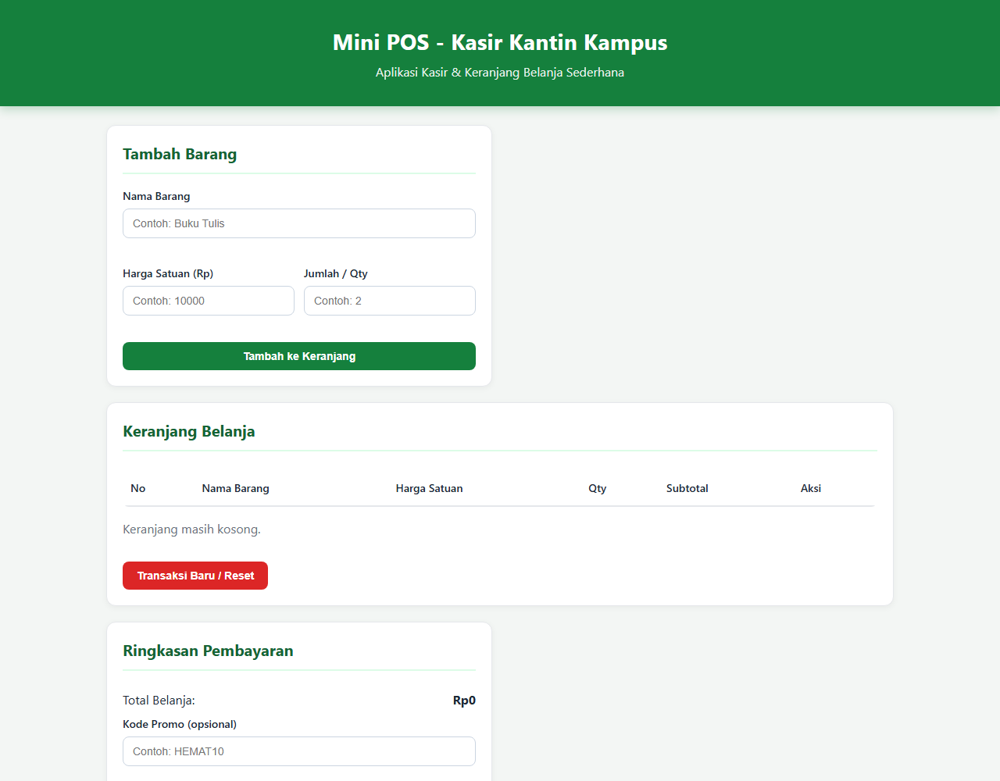
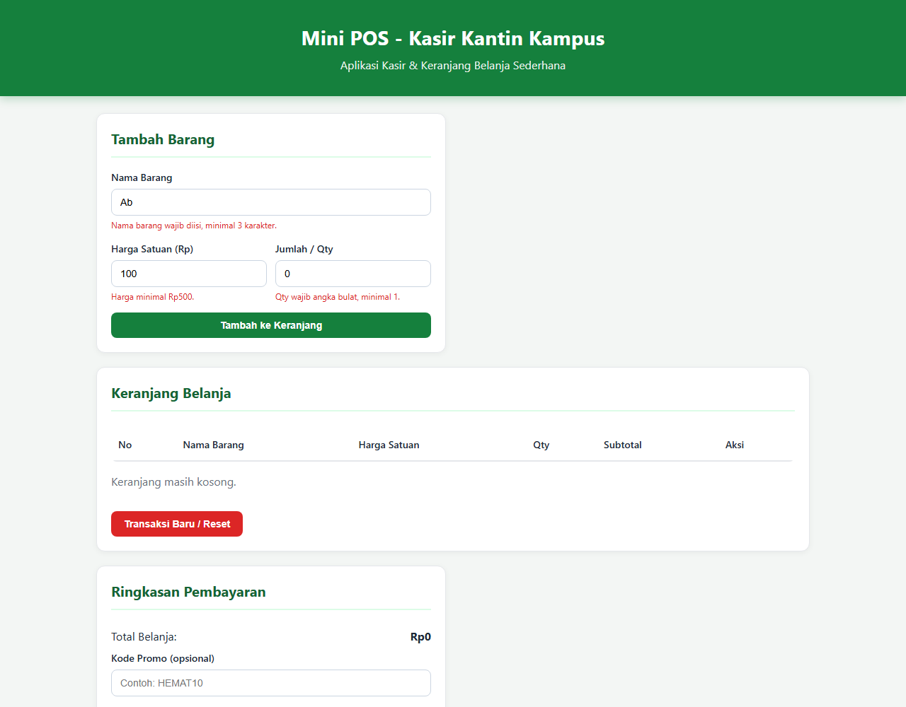
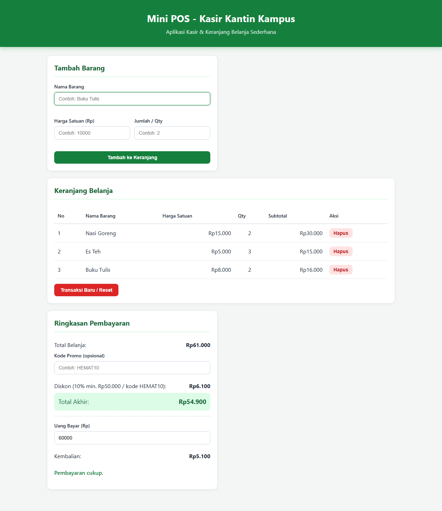

# Mini POS - Kasir & Keranjang Belanja Sederhana

## Identitas
- Nama: Muhammad Irfan Ramadhan
- NIM: 124140159
- Kelas Praktikum: Pengembangan Aplikasi Web
- Pertemuan: 1 - JavaScript Dasar

## Deskripsi Aplikasi
Aplikasi web Mini POS untuk kasir kantin / toko kampus. Studi kasus ini menyatukan tiga kompetensi dasar praktikum: validasi input form, perhitungan kalkulator otomatis, dan manajemen keranjang belanja berbasis `localStorage`.

Tujuan: kasir dapat menginput barang dengan validasi, melihat subtotal/total/diskon/kembalian otomatis, serta keranjang tetap tersimpan saat halaman di-refresh.

## Panduan Menjalankan
1. Buka folder `MuhammadIrfanRamadhan_124140159_pertemuan1` di VS Code.
2. Install extension **Live Server** (jika belum).
3. Klik kanan `index.html` -> **Open with Live Server**.
4. Untuk latihan modul: buka masing-masing folder di `modul/01-variabel-kondisional`, `02-loop-fungsi`, `03-array-objek`, `04-dom-api`, lalu buka `index.html`-nya dengan Live Server. Buka DevTools (F12) untuk melihat `console.log`.

## Daftar Fitur
- [x] Validasi Nama Barang: wajib diisi, minimal 3 karakter
- [x] Validasi Harga: wajib angka, tidak boleh 0/negatif, minimal Rp500 (pesan error berbeda tiap kasus)
- [x] Validasi Qty: bilangan bulat, minimal 1
- [x] Pesan error merah di bawah input yang salah, cegah masuk keranjang
- [x] Form otomatis reset jika berhasil
- [x] Subtotal otomatis: Harga x Qty
- [x] Total belanja otomatis (jumlah semua subtotal)
- [x] Diskon otomatis 10% jika total >= Rp50.000, tampil nominal + total akhir
- [x] Kode promo `HEMAT10` (diskon 10% walau total < Rp50.000)
- [x] Kalkulator kembalian: Uang Bayar - Total Akhir, peringatan jika kurang
- [x] Tabel keranjang: No, Nama, Harga, Qty, Subtotal, Aksi Hapus
- [x] Hapus item per baris, total/diskon hitung ulang otomatis
- [x] LocalStorage persisten (`JSON.stringify` / `JSON.parse`), tidak hilang saat refresh
- [x] Tombol Transaksi Baru / Reset (kosongkan cart + localStorage)
- [x] Format Rupiah `toLocaleString('id-ID')`, layout responsif CSS murni

## Tangkapan Layar
### 1. Form input utama


### 2. Validasi error


### 3. Hasil kalkulator + tabel keranjang


Cara ambil: jalankan Live Server, screenshot (1) form kosong, (2) isi nama "Ab" + harga 100 + qty 0 lalu submit hingga error merah muncul, (3) tambah 2-3 barang hingga total > 50000 lalu isi uang bayar.

## Penjelasan Teknis Singkat
- **Validasi:** `validasiInput(nama, harga, qty)` reset semua `.error`, cek `trim().length < 3`, `Number(harga) < 500`, `!Number.isInteger(qty) || qty < 1`. Jika `false`, `tambahBarang()` langsung `return`.
- **Kalkulator:** tiap item simpan `subtotal = harga * qty`. `hitungTotal()` pakai `reduce`. `hitungDiskon(total)` return `total * 0.1` jika `>= 50000` atau kode promo `HEMAT10` valid (`promoValid()`), else `0`. `totalAkhir = total - diskon`. `kembalian = bayar - totalAkhir`, jika negatif tampil "belum mencukupi". Event `input` pada uang bayar render ulang otomatis.
- **Render aman:** sel tabel dibuat dengan `createElement` + `textContent` agar nama barang tidak dieksekusi sebagai HTML.
- **LocalStorage:** `saveCart()` -> `localStorage.setItem(KEY, JSON.stringify(cart))`. `loadCart()` -> `JSON.parse(localStorage.getItem(KEY))` dengan try/catch, dipanggil saat load + setiap tambah/hapus. `resetTransaksi()` pakai `removeItem`.

## Struktur Folder
```
MuhammadIrfanRamadhan_124140159_pertemuan1/
├── index.html
├── style.css
├── script.js
├── README.md
├── screenshots/
└── modul/
    ├── 01-variabel-kondisional/
    ├── 02-loop-fungsi/
    ├── 03-array-objek/
    └── 04-dom-api/
```

## Repository GitHub
- Format: `pemrograman_web_itera_124140159`
- Visibilitas: Public
- Upload folder pertemuan1 ini ke repo tersebut.
